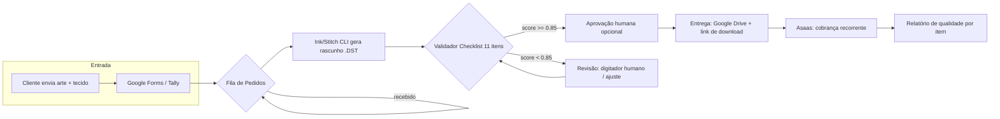

# StitchGuard — Blueprint Arquitetural

> **Documento de fundação.** Tradução da arquitetura do repositório
> `MaterialView-Pro` (https://github.com/Maycon-BertolzoDOTCOM/MaterialView-Pro)
> para o domínio de **programação de matrizes de bordado**.
>
> Objetivo: validar a arquitetura do StitchGuard com humanos antes de codificar.
> Se um ponto parecer frágil, ajuste a rota — este documento é um mapa, não uma muralha.

### Status de implementação (atualizado Ago/2026)

| Seção | Status | Observação |
|-------|--------|------------|
| 2.1 ProviderRouter | `[FEITO]` | cli_anything funcional; inkstitch/wilcom/humano são stubs (pendentes C/D) |
| 2.2 DifficultyEstimator | `[FEITO]` | `generation/difficulty.py`; difficulty="auto" na API |
| 2.3 Validador (checklist) | `[FEITO]` | 11 itens (excedeu as 9 planejadas); threshold 0.85 |
| 2.4 Async Job + polling | `[FEITO]` | SQLite (infra/fila.py), 202 + polling, persistente |
| 2.5 Idempotência | `[FEITO]` | Hash SHA-256 de conteúdo; TTL 24h; header `X-Idempotency: REPLAY` |
| 2.6 Preview SVG | `[FEITO]` | `GET /v1/preview/{job_id}` — conversão nativa pyembroidery |
| 2.7 Upload imagem | `[FEITO]` | `POST /v1/upload` — SVG/PNG → .dst + preview SVG |
| 2.8 Billing (Asaas) | `[PENDENTE]` | Stub funcional; depende de credencial (pendência C) |
| 3 Modelagem de dados | `[PARCIAL]` | Job + Validacao + User (auth) persistidos; faltam Cliente e Arquivo |
| 4 Tabela de tradução | `[FEITO]` | Maioria refletida no código |
| 5 Lições | `[DOC]` | Documentação |
| 6 Diagrama Mermaid | `[DOC]` | Ligeiramente desatualizado (11 itens, não 9) |
| 7 Roadmap | `[EM ANDAMENTO]` | Fase 2 completa; Fase 3 parcial |
| 8 Cloud-first | `[FEITO]` | Docker multi-stage, docker-compose, PostgreSQL, Redis/ARQ, S3/MinIO, JWT Auth |
| 9 Estrutura em camadas | `[FEITO]` | Detalhada em STITCHGUARD_LAYERS.md |

---

## 1. Análise Estrutural do MaterialView-Pro

### Propósito central
O MaterialView-Pro é um SaaS de simulação de materiais em qualquer superfície
(piso, parede, teto, carroceria, móvel): o usuário envia uma imagem, escolhe um
material e recebe um preview fotorrealista com **validação de invariantes
semânticos**.

### Público-alvo original
Designers, arquitetos e lojistas que precisam visualizar revestimentos
(pisos/cerâmicas) aplicados em fotos reais de ambientes — sem depender de
programador interno.

### Stack tecnológica principal

| Camada | Tecnologia |
|--------|-----------|
| Runtime | Node.js 22, Express |
| Frontend | React 18, Vite |
| IA | WaveSpeedAI (Qwen Image Edit), Zhipu CogView, Pika Labs, local fallback |
| Validação | Script de invariantes em Node.js (Buffer/pixels) |
| Billing | Asaas (assinaturas + webhook) |
| Telemetria | OpenTelemetry (no-op por padrão) |
| Testes | Vitest, supertest, fast-check |
| Infra | Docker, Vercel, GitHub Actions |

---

## 2. Decomposição da Arquitetura (Padrões-Chave)

> Cada padrão está documentado com: o que faz, onde vive no MaterialView-Pro
> e como se traduz para o StitchGuard.

### 2.1 ProviderRouter — Roteamento em Cascata

**O que faz:** encadeia múltiplos provedores de IA ordenados por custo
(`costTier`). Tenta o mais barato primeiro; se falhar, cai para o próximo.
Ao final, um fallback local que "nunca falha".

**Implementação real:** `backend/services/gateway/ProviderRouter.js`
- Ordena provedores por `costTier` (`0` gratuito → `2` caro)
- Pula provedores sem API key configurada
- Pula provedores com free tier esgotado (`CreditTracker.isExhausted`)
- Aplica timeout com `AbortController` (45s padrão)
- Promove provedor com melhor histórico (TaskMetrics, score > 0.7)
- Fallback textual descritivo (`localFallback`)

**Tradução para o StitchGuard:**

```
Arte + tecido → Roteador de Geração
  ├─ Ink/Stitch CLI   (costTier 0)  → gera rascunho .DST em ~2min
  ├─ Wilcom APIs      (costTier 1)  → digitização de maior fidelidade
  └─ Digitador humano (fallback)    → descreve/refaz manualmente, nunca falha
```

### 2.2 DifficultyEstimator — Roteamento por Complexidade

**O que faz:** classifica a requisição em `low` / `medium` / `high` por fatores
de complexidade e define um custo mínimo de provedor. Tarefas complexas pulam
os provedores gratuitos.

**Implementação real:** `backend/services/gateway/DifficultyEstimator.js`
- Tamanho da imagem (base64 em KB)
- Material fora do padrão (dimensões não-listadas)
- Número de objetos na cena
- Iluminação desconhecida

**Tradução para o StitchGuard — fatores de dificuldade da arte:**

| Fator | low | medium | high |
|-------|-----|--------|------|
| Tamanho da arte (mm) | < 100×100 | 100–300 | > 300 |
| Nº de cores | ≤ 3 | 4–8 | > 8 |
| Nº de pontos estimados | < 10k | 10k–50k | > 50k |
| Tecido | Malha simples | Jeans / Nylon | Boné com costura pré-existente |
| Texto/curvas (satin) | Pouco | Moderado | Muito |

Regra: `high` exige Wilcom APIs ou digitador humano. `low` roda direto no Ink/Stitch.

### 2.3 Validador Pós-Processamento (Gerador-Verificador)

**O que faz:** valida o resultado da IA **após** a geração. Cada invariante
retorna um score contínuo `[0.0, 1.0]`; `violated = true` quando
`score < threshold`. Foi a lição central do projeto: *"a IA gera, mas não
verifica"*.

**Implementação real:** `backend/services/core/validator.js`
- Invariantes: sombras (0.70), geometria (0.80), objetos (0.75), perspectiva (0.85)
- Análise de pixels via Buffer nativo do Node
- Cache de resultados TTL 5min

**Tradução para o StitchGuard — o Checklist de 11 itens como invariantes:**

| # | Invariante | O que validamos | Threshold |
|---|-----------|-----------------|-----------|
| 1 | Tipo de tecido | Parâmetros compatíveis com malha/jeans/nylon/boné | reprovado se incompatível |
| 2 | Compensação | Ajustada para o tecido (elástico encolhe/estica) | fora da faixa = fail |
| 3 | Amarração | Underlay ativado (evita afundamento) | ausente = fail |
| 4 | Densidade | Pontos/cm dentro de 0.35–0.50 | fora = fail |
| 5 | Saltos (jumps) | Todos < 5mm | ≥5mm = fail |
| 6 | Ordem de costura | Preenchimento antes do contorno | inversa = fail |
| 7 | Ângulos do satin | Acompanhando a curva | divergente = fail |
| 8 | Nós | Lock stitch no início e fim (não solta) | ausente = fail |
| 9 | Limite de pontos | Dentro do esperado para o tamanho | fora = fail |

O Score Global do StitchGuard = média ponderada dos 11 itens. `≥ 0.85` aprova
para entrega; abaixo, retorna para revisão humana.

### 2.4 Async Job — 202 + Polling (Fila)

**O que faz:** POST retorna `202 Accepted` + `jobId`; o cliente faz polling em
`GET /:jobId/status`. O processamento pesado roda em background via
`setImmediate`.

**Implementação real:** `backend/services/core/JobManager.js`
- Fila em memória com TTL 1h e limpeza a cada 5min
- Índice `cacheKey` → deduplicação O(1)
- Status: `pending → processing → completed | failed`
- Campo `progress` para o cliente acompanhar

**Tradução para o StitchGuard:**

```
Pedido criado → Recebido → Gerando (IA) → Validando (Checklist) → Concluído | Falhou
```

| Campo | Descrição |
|-------|-----------|
| `id` | UUID do pedido |
| `clienteId` | Dono do pedido |
| `artefatoKey` | Hash da arte + tecido (deduplicação) |
| `status` | recebido / gerando / validando / concluído / falhou |
| `progress` | 0–100% (recepção, geração, validação, entrega) |
| `resultado` | URL/arquivo .DST final |
| `erro` | Motivo da falha (se houver) |

> MVP (Fase 1) pode usar Trello + Zapier como fila visual. A partir da Fase 3,
> migrar para uma fila real (SQLite → Postgres/Redis).

### 2.5 Idempotência — Idempotency-Key

**O que faz:** evita processamento duplicado. O cliente envia um header
`Idempotency-Key`; a segunda chamada com a mesma chave retorna o resultado
anterior em vez de reprocessar.

**Implementação real:** `backend/middleware/idempotency.js`
- SHA-256 da chave crua
- TTL 24h com eviction agendada
- Header de resposta `X-Idempotency: REPLAY`

**Tradução para o StitchGuard:** cada arte enviada recebe um hash único
(`sha256(arte + tecido + tamanho)`). Se o mesmo cliente reenviar a mesma arte
dentro de 24h, o sistema reaproveita o job em andamento/concluído — evita
cobrança dupla e fila entupida.

### 2.6 Billing — Planos e Créditos

**O que faz:** assinaturas recorrentes via Asaas, planos com créditos mensais,
webhook que atualiza o status do cliente.

**Implementação real:**
- `backend/services/billing/asaasService.js` — criar cliente, assinatura mensal, link de checkout
- `backend/routes/billing.js` — webhook com `ASAAS_WEBHOOK_SECRET` **obrigatório em produção** (lição SEC-07: secret ausente aceitava tudo) e deduplicação de `paymentId`
- `backend/services/planConfig.js` — créditos por plano
- `backend/services/gateway/CreditTracker.js` — contador com rollover mensal

**Tradução para o StitchGuard:**

| Plano | Matrizes/mês | Preço | Créditos de validação extra |
|-------|--------------|-------|-----------------------------|
| Bronze | 5 | R$ 497 | sem |
| Prata | 15 | R$ 997 | 5 revisões humanas/mês |
| Ouro | 50 | R$ 2.497 | revisões ilimitadas |
| Avulso | 1 | R$ 150 | pagamento único |

Cobrança: assinatura mensal no Asaas (Pix/boleto/cartão). Matrizes urgentes
(avulso) saem do plano com markup de velocidade.

---

## 3. Modelagem de Dados

```
┌────────────┐    1      N ┌────────────┐   1   N ┌────────────┐
│  Cliente   │────────────>│  Pedido    │────────>│  Validacao  │
│  id        │             │  id        │         │  id         │
│  nome      │             │  arteKey   │         │  pedidoId   │
│  email     │             │  tecido    │         │  item       │ (1..9)
│  plano     │             │  status    │         │  score      │
│  credits   │             │  progress  │         │  aprovado   │
└────────────┘             │  resultado  │         └────────────┘
                           └──────┬─────┘
                                  │ 1
                                  │ N
                             ┌────┴───────┐
                             │  Arquivo   │
                             │  arte (svg/png)  │
                             │  matriz (.dst/pes)│
                             └────────────┘
```

**Entidades principais:**
- **Cliente** — ateliê/empresa que assina. Contém plano e créditos (derivado do `apiKeyStore` + `CreditTracker`)
- **Pedido** — o Job. Arte + tecido + status + progresso + resultado (derivado do `JobManager`)
- **Validacao** — um registro por item do checklist (11 por pedido), com score e aprovação (derivado do `validator`)
- **Arquivo** — arte de entrada (.svg/.png) e matriz de saída (.dst/.pes)

**Entrada:** upload da arte + parâmetros (tecido, tamanho, nº de cores).
**Saída:** arquivo .DST validado + relatório de qualidade por item do checklist.

---

## 4. Tabela de Tradução Completa

| Funcionalidade MaterialView-Pro | Análogo no StitchGuard |
|---------------------------------|------------------------|
| Envio de imagem + escolha de material | Envio da arte (.svg/.png) + escolha do tecido (malha, jeans, nylon, boné) |
| Provedor 1: WaveSpeedAI (grátis) | **Ink/Stitch CLI** (open-source, gratuito) — gera rascunho .DST |
| Provedor 2: Zhipu CogView (pago) | **Wilcom EmbroideryStudio APIs** — digitização de alta fidelidade |
| Provedor 3: Pika Labs | (opcional) **Hatch / PE-Design** para tipos específicos |
| Fallback: local (textual) | **Digitador humano** — descreve o problema e refaz manualmente |
| Validador: shadow, geometry, objects, perspective | **Checklist de 11 invariantes** (compensação, densidade, saltos, ordem, satin, nós, limites, cores, aro) |
| JobId + status (recebido, processando, concluído) | **Status do pedido** (recebido, gerando, validando, concluído, falhou) |
| Idempotency-Key | Hash da arte + tecido (deduplicação de pedidos) |
| Cache de simulação (TTL 30min) | Cache de validação (evita revalidar matrizes idênticas) |
| Sistema de créditos (trial/basic/popular/pro) | Planos de assinatura (Bronze/Prata/Ouro/Avulso) |
| Billing via webhook (Asaas) | Cobrança recorrente (Pix/boleto/cartão) via Asaas |
| DifficultyEstimator (low/med/high) | Complexidade da arte → roteia para Ink/Stitch ou digitador humano |
| OpenTelemetry | Adiar para depois do MVP |

---

## 5. Lições Aprendidas

### O que copiar (lógica, não código)

1. **Validação pós-geração é o coração do negócio.** A vantagem competitiva do
   StitchGuard é a *garantia* — o validador de 11 itens é o seu `validator.js`.
   Nunca entregue matriz gerada por IA sem passar pelo checklist.
2. **Cascata com fallback "que nunca falha".** Enquanto a IA está fora do ar, o
   digitador humano assume. O cliente nunca fica sem resposta.
3. **Deduplicação de pedidos (idempotência).** Evita cobrança dupla e fila
   entupida quando o cliente clica "enviar" duas vezes.
4. **Webhook com secret obrigatório em produção.** (lição SEC-07 do
   MaterialView-Pro) — sem `ASAAS_WEBHOOK_SECRET`, qualquer POST pode ativar
   cobrança. Validar com timing-safe compare.
5. **Limites de tamanho no cache (OOM).** Matrizes .DST são leves, mas relatórios
   com previews em base64 crescem. Defina `MAX_ENTRY_BYTES` e evite estourar RAM.
6. **Roteamento por dificuldade.** Não gaste Wilcom (caro) em arte de baixa
   complexidade; não entregue Ink/Stitch cru em peça complexa.
7. **Status + progresso explícitos.** O cliente precisa ver onde o pedido está.
   Isso é parte da "garantia".

### O que evitar no MVP

1. **OpenTelemetry / tracing distribuído** — zero valor para validar o modelo de
   negócio. Adicione só quando houver múltiplos serviços.
2. **Multi-provider complexo com 3+ IAs** — comece com Ink/Stitch + fallback
   humano. Wilcom só quando um cliente real pagar por fidelidade.
3. **Billing enterprise (trial/enterprise/rollover)** — comece com 2–3 planos e
   pagamento avulso. Asaas sandbox basta para validar.
4. **Frontend rebuscado (3D, PlayCanvas)** — no início, um formulário
   (Google Forms/Tally) + Trello + Drive resolvem a validação de mercado.
5. **Cache em memória como fonte de verdade** — para MVP ok; para escala, migre
   para Postgres/Redis (o MaterialView-Pro aponta o mesmo em ADR-005).

### Caminho de implementação (arquiteto solo)

```
Fase 1 (1 semana)  — FLUXO MANUAL   R$ 0
Fase 2 (2 semanas) — SCRIPT PYTHON  R$ 0
Fase 3 (2 meses)   — AUTOMAÇÃO      R$ 5.000 (dev/APIs)
Fase 4 (3 meses)   — ESCALA         lucro reciclado
```

---

## 6. Diagrama Mermaid — Fluxo Adaptado



---

## 7. Roadmap de Implementação

| Fase | O que | Prazo | Custo | Critério de saída |
|------|-------|-------|-------|-------------------|
| **1 — MVP manual** | Forms + Trello + Checklist de 11 itens em planilha + Drive | 1 semana | R$ 0 | 1 pedido real entregue com garantia |
| **2 — Automação 1** | Script Python (pyembroidery) que valida .DST automaticamente: saltos, densidade, nós, cores, aro | 2 semanas | R$ 0 (próprio) | Validação automática substitui a manual em 7/11 itens |
| **3 — Automação 2** | Fila real (SQLite→Postgres), pedido com status/progresso, integração Ink/Stitch CLI + Wilcom APIs, assinatura Asaas | 2 meses | R$ 5.000 (dev) | 10 clientes pagantes; SLA de entrega em 4h |
| **4 — Escala** | Terceirizar validação, migrar para Postgres/Redis, painel do cliente | 3 meses | lucro reciclado | 10 clientes fixos sem gargalo no validador |

---

## 8. O Que Este Documento Valida

- **O problema é real?** Ateliês realmente sofrem com matrizes de baixa qualidade?
- **A solução é desejada?** Eles pagariam por garantia e velocidade?
- **O preço faz sentido?** R$ 997 por 15 matrizes é atrativo ou assustador?
- **A arquitetura é viável?** O fluxo acima é exequível com Ink/Stitch + Python + Asaas?

---

## 9. Estrutura em Camadas

O detalhamento completo da arquitetura em camadas está em
[STITCHGUARD_LAYERS.md](STITCHGUARD_LAYERS.md).

**Resumo:**
- **L0 — Interface:** Recepção de pedidos (Tally/Google Forms no MVP → React/Vite no futuro)
- **L1 — Application:** API FastAPI + middleware (auth, rate-limit, idempotência)
- **L2 — Domain:** Entidades Pydantic (Pedido, Cliente, Matriz, Validacao)
- **L3 — Generation:** ProviderRouter em cascata (Ink/Stitch → cli-anything → Wilcom → digitador humano)
- **L4 — Validation:** Checklist de 11 itens via pyembroidery (movido de `validator/`)
- **L5 — Commercial:** Asaas + Google Drive + SMTP
- **L6 — Infra:** Fila SQLite → Redis, storage, structlog

**Stack de backend definida:** Python + FastAPI (validador já em Python; integração
direta com Ink/Stitch; OpenAPI automático para o padrão de polling JobId).

---

*StitchGuard — A Fábrica de Matrizes Autônoma.*
*Comece enxuto, valide rápido, escale com lucro.*
